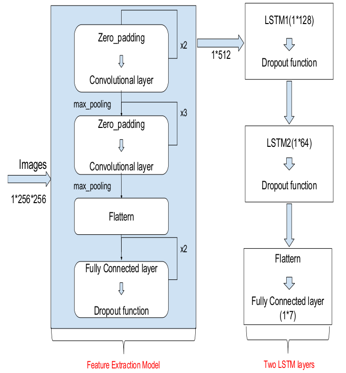

# Facial emotion detection using CNN-LSTM

## Introduction

In this project we explore human recognition system to identify 7 types of emotions by using FER2013 dataset. 
We aim to classify the emotion on a person's face into one of **seven categories**, using CNN model features to a Long Short-Term Memory(LSTM) networks.
This dataset consists of 35887 grayscale, 48x48 sized face images with **seven emotions** - angry, disgusted, fearful, happy, neutral, sad and surprised.

The repository is currently compatible with `tensorflow-2.0` and makes use of the Keras API using the `tensorflow.keras` library.

* The [original FER2013 dataset in Kaggle](https://www.kaggle.com/deadskull7/fer2013) is available as a single csv file. I had converted into a dataset of images in the PNG format for training/testing and provided this as the dataset in the previous section.

## Algorithm

* First, the **haar cascade** method is used to detect faces in each frame of the webcam feed.

* The region of image containing the face is resized to **48x48** and is passed as input to the CNN.

* Then we extract features from CNN and pass into **LSTM** Model.

* The network outputs a list of **softmax scores** for the seven classes of emotions.

* The emotion with maximum score is displayed on the screen.

## Model Architecture

